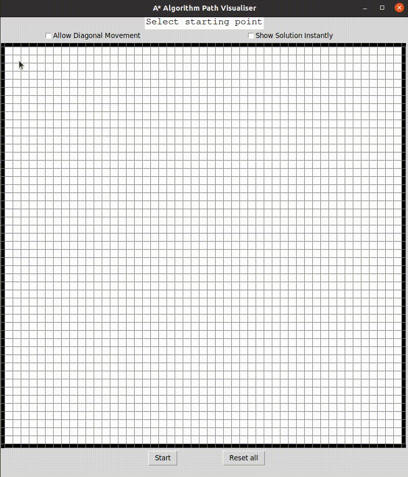
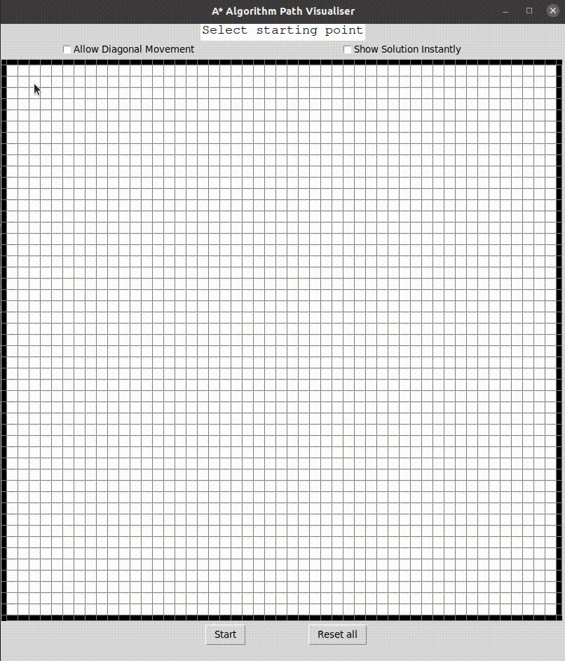
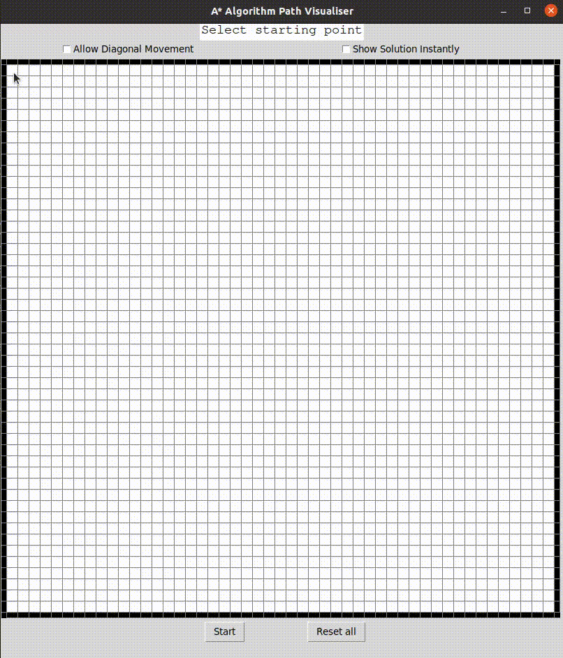

# A-star-path-visualizer
A desktop app for visualizing the A* path finding algorithm. It allows the user to select start and end points as well as draw obstacles for the program to find the shortest path through. There is also an option to toggle diagonal movement on and off to see the differences between paths the program chooses.

# Requirements
- Python 3.x
- Tkinter
- Numpy

# Features
- The instruction panel guides through the entire process.
- Toggle diagonal movement to see difference in paths.
- 'Instant Solution' option skips delay in animation to speed up visualizing process.
- Ability to set or reset any block easily.

# Demonstration
<h3>General</h3>

<h3>Allowing Diagonal Movement</h3>

<h3>Instant Solution</h3>
